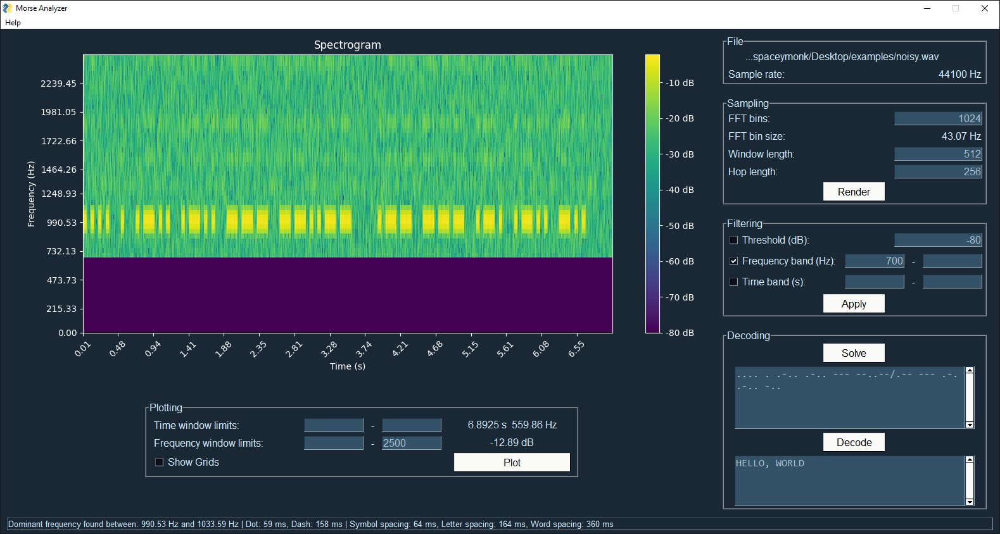

# morse-analyzer
 Analyze, tweak and extract morse code from audio files.

 

# Installation
`pip install -r requirements.txt`

# Run
`python main.py`

# How to Use?

> [Video Tutorial](https://youtu.be/KeBg3VXJFjk)

1. Load an audio file (only WAV files supported, you have to convert your audio file to WAV)
2. Adjust the plot.
3. Apply some filters.
4. If output is somewhat understandable click `Solve` to generate dits and dats.
5. Click `Decode` to translate morse code to language.

**Note:** If Step 4 did not work out, you can enter the dits and dats by hand.
